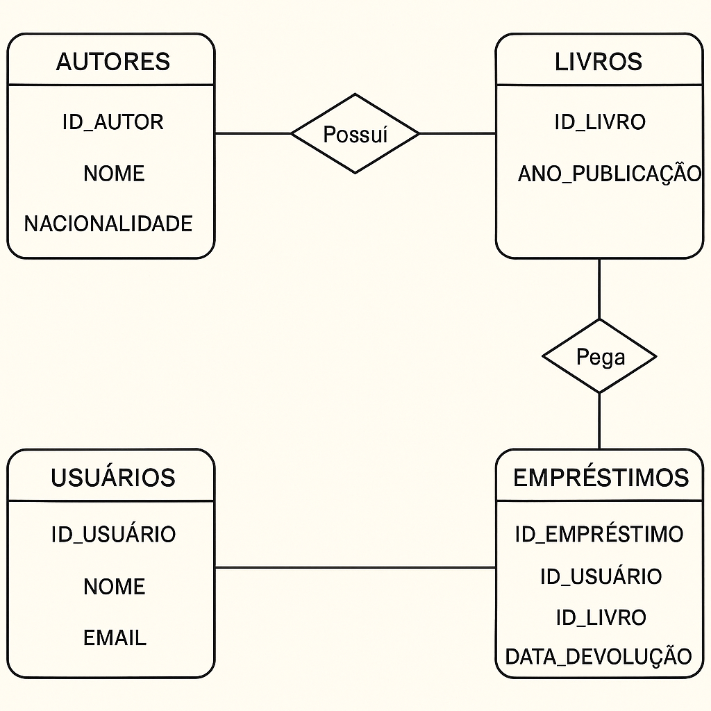

# Biblioteca

Este projeto é um **sistema de gerenciamento de biblioteca**
desenvolvido em **SQL (Oracle)**.\
O objetivo é praticar conceitos de **modelagem de dados, DDL, DML e
consultas SQL**.

------------------------------------------------------------------------

## 🚀 Estrutura

- `scripts/01_create_tables.sql` → Criação das tabelas
- `scripts/02_insert_data.sql` → Inserção de dados iniciais
- `scripts/03_queries.sql` → Consultas principais
- `scripts/04_updates.sql` → Exemplos de updates/deletes
- `scripts/drop_tables.sql` → Reset do banco

------------------------------------------------------------------------

## 📊 Modelo Entidade-Relacionamento (ER)



**Descrição:**\

- Um **autor** pode ter vários **livros**.\

- Um **usuário** pode pegar vários **livros emprestados**.\
- Um **empréstimo** relaciona **usuário e livro**.

------------------------------------------------------------------------

## 🛠️ Como rodar

1. Clone o repositório:

    ``` bash
    git clone https://github.com/seuusuario/biblioteca-sql.git
    cd biblioteca-sql/scripts
    ```

2. Execute os scripts no Oracle SQL Developer ou VS Code com plugin
    SQL:

    ``` sql
    @01_create_tables.sql
    @02_insert_data.sql
    @03_queries.sql
    ```

3. Para resetar o banco:

    ``` sql
    @drop_tables.sql
    ```

------------------------------------------------------------------------

## 📌 Tecnologias

- Oracle Database
- SQL (DDL, DML, DQL)
- VS Code + extensão SQL

------------------------------------------------------------------------

## ✨ Autor

Desenvolvido por **Gustavo Costa** 🚀
